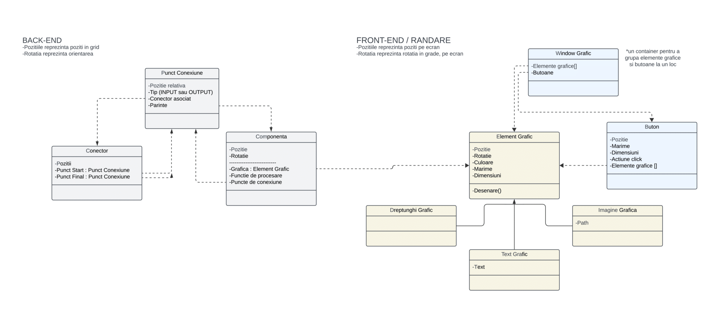

<div align = "center">

# Electron

<b>Electronic Circuit Builder and Simulator</b>

[Video Presentation (Romanian)](https://www.youtube.com/watch?v=p6TlDJz7GH0)


*Made by 2 Computer Science students in year 1*

</div>

## Getting Started
> **Note:** At the moment, the app only runs on Windows x64 platforms.
<br>

1. Download "Electron_64X.rar" from our latest release 
    - [Download Latest Release](https://github.com/mircea27c/Electron/releases/latest)

2. Extract "Electron_64X.rar"

3. Run "ELECTRON.exe"

<br>

## How to use

<br>

- Place the components on the grid
- Connect the components by dragging on their blue and orange connection points
- Simulate the circuit by pressing the start button at the top (only the Voltage Source generates an electrical signal)
- Blue points are for INPUT and orange points are for OUTPUT (electrical current should **COME OUT** of the **OUTPUT** points and **go IN** the **INPUT** points
- Save files are stored in .txt files
  
<br>

## Adding a new component type

> We recommend taking a look at the **Development Guide** in the next section as well.

<br>

Since the Component types haven't been decoupled from the app's code, adding new components will involve modifying the source code.

<br>

1. Creation of the component:
   <br>
       Inside TipuriComponente.cpp > InitializareTipuriComponente() you'll need to add a new line for adding your new Component
     ```cpp
     void TipuriComponente(){

     ...

	tipuri_componente[10]->functie_procesare = procesare_connector;

	puncte.clear();

    //-----EXISTING CODE ENDS HERE
     //-----YOUR NEW CODE IS HERE

     CreazaComponenta("path/to/your/bmp/image", Vector2(MARIME_COMPONENTE, MARIME_COMPONENTE), puncte);

    //------EXISTING CODE CONTINUES
     ...
     }

   ```
2. Increase the number of components inside TipuriComponente.h

    ```cpp
    
    int const nr_componente = 12;
    //Increased this by 1 (there are originally 11 components)
    //make sure it matches the number of calls to CreeazaComponenta(...) made in TipuriComponenta.cpp

    ```

3. Create the associated button in Aplicatie.cpp > InitializareUI (The "footer_butoane" region)

   ```cpp
    
    Buton* sursavoltaj = CreareButon(Vector2(0, 0), Vector2(latime_buton, inaltime_buton), culoare_btn, culoare_comp, "Desenecomponente/sursavoltaj.bmp", 0, "voltage source");
    Buton* rezistor = CreareButon(Vector2(0, 0), Vector2(latime_buton, inaltime_buton), culoare_btn, culoare_comp, "Desenecomponente/rezistor.bmp", 1, "rezistor");
    Buton* intrerupator = CreareButon(Vector2(0, 0), Vector2(latime_buton, inaltime_buton), culoare_btn, culoare_comp, "Desenecomponente/bec.bmp", 2, "light bulb");
    Buton* andGate = CreareButon(Vector2(0, 0), Vector2(latime_buton, inaltime_buton), culoare_btn, culoare_comp, "Desenecomponente/andgate.bmp", 3,"and gate");
    Buton* capacitor = CreareButon(Vector2(0, 0), Vector2(latime_buton, inaltime_buton), culoare_btn, culoare_comp, "Desenecomponente/capacitor.bmp",4 ,"capacitor");
    Buton* dioda2linii = CreareButon(Vector2(0, 0), Vector2(latime_buton, inaltime_buton), culoare_btn, culoare_comp, "Desenecomponente/dioda2linii.bmp", 5, "varicap diode");
    Buton* diodacerc = CreareButon(Vector2(0, 0), Vector2(latime_buton, inaltime_buton), culoare_btn, culoare_comp, "Desenecomponente/diodacerc.bmp", 6, "diode");
    Buton* impamantare = CreareButon(Vector2(0, 0), Vector2(latime_buton, inaltime_buton), culoare_btn, culoare_comp, "Desenecomponente/impamantare.bmp",7, "ground");
    Buton* tranzistor = CreareButon(Vector2(0, 0), Vector2(latime_buton, inaltime_buton), culoare_btn, culoare_comp, "Desenecomponente/tranzistor.bmp", 8,  "tranzistor");
    Buton* splitter = CreareButon(Vector2(0, 0), Vector2(latime_buton, inaltime_buton), culoare_btn, culoare_comp, "Desenecomponente/2splitter.bmp", 9, "2 way splitter");
    Buton* connector = CreareButon(Vector2(0, 0), Vector2(latime_buton, inaltime_buton), culoare_btn, culoare_comp, "Desenecomponente/2splitter.bmp", 10, "2 way connector");

   //ADD YOUR COMPONENT BUTTON HERE-(COPY THE CODE ABOVE)--------------------------------------
   Buton* your_component = CreareButon(Vector2(0, 0), Vector2(latime_buton, inaltime_buton), culoare_btn, culoare_comp, "path/to/component/icon", INDEX_OF_COMPONENT (should be 1 more than the last)  , "name of component");

    footer_butoane->AdaugaButon(sursavoltaj);
    footer_butoane->AdaugaButon(splitter);
    footer_butoane->AdaugaButon(connector);
    footer_butoane->AdaugaButon(rezistor);
    footer_butoane->AdaugaButon(intrerupator);
    footer_butoane->AdaugaButon(andGate);
    footer_butoane->AdaugaButon(capacitor);
    footer_butoane->AdaugaButon(dioda2linii);
    footer_butoane->AdaugaButon(diodacerc);
    footer_butoane->AdaugaButon(impamantare);
    footer_butoane->AdaugaButon(tranzistor);

    //REGISTER YOUR NEWLY CREATED BUTTON HERE-----------------
    footer_butoane->AdaugaButon(your_component);
   
   ```

4. Create your connection points inside TipuriComponente.cpp

   ```cpp

     void TipuriComponente(){

     ...

	tipuri_componente[10]->functie_procesare = procesare_connector;

	puncte.clear();

    //-----ADD THE CONNECTION POINTS ABOVE YUOR CREATION CALL

     /// their position is relative to the top left corner of the cell, and ranges from 0 to 1
     puncte.push_back(new PunctConexiune(Vector2(0.3f, 0.5f), nullptr, STANGA, PunctConexiune::OUTPUT));
	 puncte.push_back(new PunctConexiune(Vector2(0.7f, 0.5f), nullptr, DREAPTA, PunctConexiune::INPUT));

    /// You can add as many as you want, but only 4 at a time will be able to maintain connections

     CreazaComponenta("path/to/your/bmp/image", Vector2(MARIME_COMPONENTE, MARIME_COMPONENTE), puncte);
   
    //------MAKE SURE TO CLEAR THE LIST AFTER YOUR CALL
   
    puncte.clear();
   
     ...
   
     }

   ```

5. Create your functionality inside the same function

   ```cpp

     void TipuriComponente(){

     ...

    //-----ADD THE CONNECTION POINTS ABOVE YUOR CREATION CALL

     /// their position is relative to the top left corner of the cell, and ranges from 0 to 1
     puncte.push_back(new PunctConexiune(Vector2(0.3f, 0.5f), nullptr, STANGA, PunctConexiune::OUTPUT));
	 puncte.push_back(new PunctConexiune(Vector2(0.7f, 0.5f), nullptr, DREAPTA, PunctConexiune::INPUT));

    /// You can add as many as you want, but only 4 at a time will be able to maintain connections

     CreazaComponenta("path/to/your/bmp/image", Vector2(MARIME_COMPONENTE, MARIME_COMPONENTE), puncte);
   
    //------MAKE SURE TO CLEAR THE LIST AFTER YOUR CALL
   
    puncte.clear();

    //DECLARE YOUR PROCESSING FUNCTION HERE

    tipuri_componente[YOUR_COMPONENT_INDEX (11 for the first one you add)]->functie_procesare = your_processing_fuction
   
     ...
   
     }

   ```

5. Creating the processing function
       <br>
       The processing function takes in as parameters the input connections that already receive electricity, and returns a list of the output connections that should receive, based on the *logic you implement*

    The function's template is this:

    ```cpp  
	auto your_processing_function = [](Componenta* comp, bool* puncte_curent) -> bool* {
		bool* output_valid = new bool[comp->nr_pct_conexiune];
		for (int i = 0; i < comp->nr_pct_conexiune; i++)
		{
			output_valid[i] = false;
		}

        //YOUR CUSTOM LOGIC START HERE
        //The order in which you register your connection points matters, since it indicates their index in the puncte_curent
        //and output_valid arrays

	    //AND ENDS HERE
  
       return output_valid;
	};

   ```

6. Adding the icon
   <br>
       The icon should be in .bmp format. You can put it in any location inside /bin; **/bin/Desenecomponente** is recommended
       Then you should replace all the "path/to/your/icon" strings in the code you added with the actual path to your icon, relative         to the bin directory (e.g. "Desenecomponente/your_component.bmp")
   

<br>

## Development Guide

> **Note:** Content in Romanian ahead.

<div align = "center">
  
For people looking to extend/modify this app:
<br>
#### This provides an overview of the main data structures used and the relations amongst them:

<br>



#### This is an overview of all the files in the project, and their role regarding the App object and its UI Manager

<br>


<br>

This app uses SDL for its graphics

</div>


